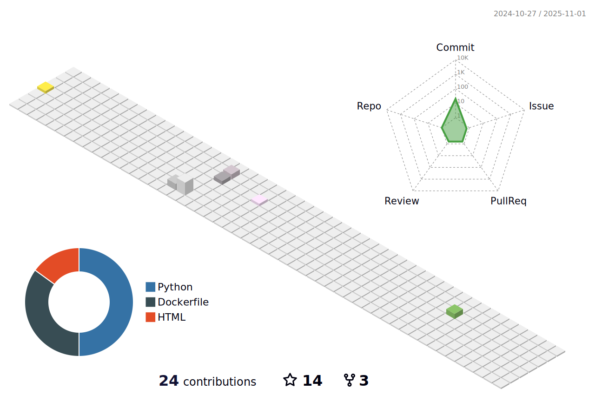

# 💫About Me :
👋 Hi, I’m Anubhav,
👀 I’m interested in All stuff ML (Computer Vision, Audio Signal Processing, NLP)
🌱 I’ve 3 years experience working as a ML Research Engineer and I'm a wannabe research scientist in ML
💞️ I’m looking to collaborate on all stuff ML and Python
📫 How to reach me : 🐤@abtExp_

## 🌐Socials
    

# 💻Tech Stack
                 
# 📊GitHub Stats :
 
 

## 🏆GitHub Trophies

### ✍️Random Dev Quote

### 😂Random Dev Meme

---

  ## 💰You can help me by Donating
   

  <!-- Proudly created with GPRM ( https://gprm.itsvg.in ) -->
  
  
  
